> **Hinweis zum Umfang dieses Repositories**
>
> Dieses Repository enthält ausschließlich die **Embedded-Steuerungssoftware**, die auf dem
> **ESP32** des MacroRat-Roboters ausgeführt wird. Sie umfasst:
> - Sensorabfragen (Entfernungssensoren, Encoder, Gyroskop)
> - Motorsteuerung und Bewegungslogik
> - Labyrinthkarte und interne Zustandsspeicherung
> - Navigations- und Pfadfindungsalgorithmen
>
> Für das ursprüngliche Projekt wurde zusätzlich ein **Raspberry Pi** als **Webserver** verwendet,
> um eine grafische Benutzeroberfläche zur Statusanzeige und Kartendarstellung bereitzustellen.
> Die Implementierung dieses Webinterfaces war **nicht Teil meines Aufgabenbereichs** und ist
> daher **nicht in diesem Repository enthalten**.
>
> Ebenso gehören die Module `communication_interface` und `nfc_reader` **nicht zu meinem bearbeiteten Code**
> und sind daher **weder als `.h`- noch `.cpp`-Dateien** im Repository enthalten.

---


> **Hinweis:** Wenn du Änderungen an der `README.md` vornehmen möchtest, führe bitte zuerst folgenden Befehl aus:
>
> ```bash
> ./setup_hooks.sh
> ```
>
> Damit wird ein lokaler Git-Hook eingerichtet, der sicherstellt, dass alle Diagramme (png-Dateien) vor jedem Commit aktuell sind.


# Softwarekonzept für MacroRat

## 1. Einleitung
### 1.1 Ziel und Zweck dieses Dokuments
Dieses Dokument beschreibt das Softwarekonzept des autonomen Fahrzeugs *MacroRat*. Es dient als technische Grundlage für die Implementierung der eingebetteten Software auf dem Mikrocontroller des Fahrzeugs. Die Weboberfläche wird in einem separaten Dokument behandelt und ist nicht Bestandteil dieses Konzepts.

Ziel ist es, die Struktur der Softwarekomponenten, deren Interaktionen sowie die verwendeten Algorithmen und Schnittstellen systematisch zu erfassen und verständlich darzustellen.

### 1.2 Entwicklungsumgebung und Werkzeuge
Die Software wird in C/C++ mit Visual Studio Code und der PlatformIO-Erweiterung entwickelt und auf einen NMCU-ESP32 geflashed. Für die Versionsverwaltung wird Git verwendet. Als Framework kommt das ESP32-Arduino-Paket zum Einsatz, da es viele fertige Libraries (z. B. für Sensoren und Motorsteuerung) bietet. Build und Upload erfolgen über PlatformIO, getestet wird auf dem lokalen ESP32-Board.

---

## 2. Softwarearchitektur

### 2.1 Überblick über die Systemstruktur

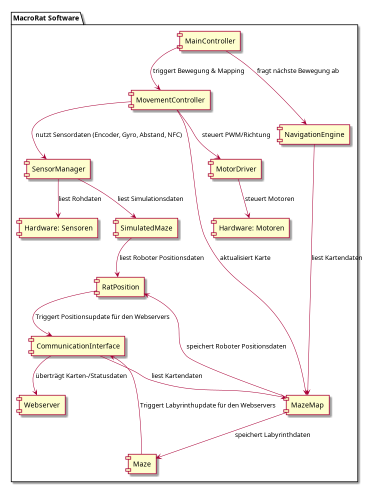
**Abbildung 1:** Komponentendiagramm von MacroRat.

Die Software ist modular aufgebaut und besteht aus folgenden Hauptkomponenten:

- **MainController (Klasse)**: Zentrale Steuereinheit, die den Systemzustand verwaltet und die Interaktion aller Module koordiniert.

- **MovementController (Klasse)**: Kombiniert die Bewegung des Roboters und die gleichzeitige Kartierung der Umgebung

- **MotorDriver (Klasse)**: Steuert die Motoren über PWM-Signale.

- **SensorManager (Klasse)**: Initialisiert und liest Sensoren (Abstandssensoren, Gyroskop, Encoder, NFC) aus und interpretiert die Rohdaten (z. B. Wände erkannt, Falle detektiert). Alternativ kann der `SensorManager` statt echter Sensordaten auch simulierte Werte aus der Klasse `SimulatedMaze` verwenden.

- **SimulatedMaze (Klasse)**: Enthält verschiedene vordefinierte Labyrinthe, deren Daten statt echter Sensormesswerte für Simulationen genutzt werden können.

- **MazeMap (Klasse)**: Zur Repräsentation des Labyrinths und Position des Roboters, bestehend aus zwei Komponenten:
  - **Maze (Klasse)**: Speichert die bekannten Wände und Zellinhalte in einem festen Gitter, zentriert um die Position (0,0).
  - **RatPosition (Klasse)**: Hält die aktuelle logische Position und Orientierung des Roboters im Labyrinth fest.

- **NavigationEngine (Klasse)**: Plant Bewegungen basierend auf der aktuellen Karte und berechnet die nächste Bewegung zum Ziel mithilfe eines ausgewählten Algorithmus.

- **CommunicationInterface (Klasse)**: Verbindet den Roboter über WLAN mit dem Webserver, überträgt Karten- und Statusdaten und ermöglicht (optional) manuelle Steuerung durch empfangene Kommandos.

Alle Module interagieren über klar definierte Schnittstellen. Die Architektur folgt einem zustandsbasierten Ablaufmodell, das vom MainController gesteuert wird.


---

### 2.2 Modul: main_controller

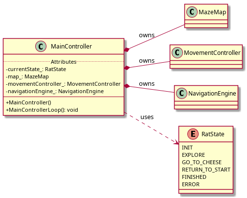
**Abbildung 2:** Klassendiagramm der Klassen im Zusammenhang mit `MainController`.

#### 2.2.1 Zweck
Das Modul `main_controller` ist für die zentrale Ablaufsteuerung des Roboters verantwortlich. Im Konstruktor initialisiert es alle benötigten Module. Die Methode `MainControllerLoop()` beinhaltet eine kontinuierlich laufende Hauptschleife, in der der Roboter abhängig vom aktuellen Systemzustand gesteuert wird.

#### 2.2.2 Zustände

Das Verhalten des Roboters wird durch einen internen Zustandsautomaten gesteuert. Es gibt keinen expliziten Initialzustand, da die Initialisierung bereits vor dem Eintritt in `main_loop()` erfolgt. Die Zustände werden als `enum class RatState` definiert. Das folgende Diagramm zeigt die Zustandsübergänge des `main_controller`:

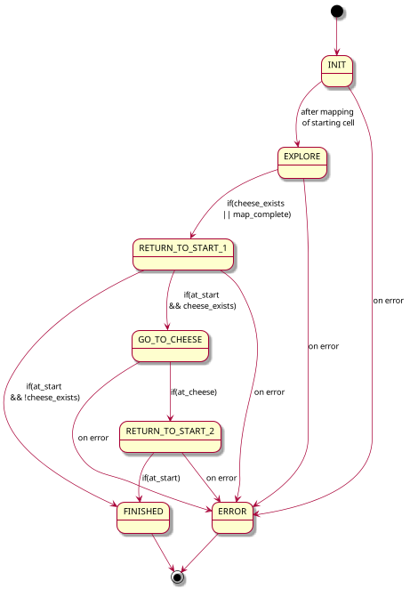
**Abbildung 3:** Zustandsdiagramm des Moduls `main_controller`.

##### 2.2.2.1 Ablauf im Zustand `STATE_INIT`
Im Zustand `STATE_INIT` erkundet der Roboter zunächst die Startzelle, indem er die Wände auf der linken, vorderen und rechten Seite analysiert. Anschließend dreht er sich um 90° nach links, um auch die Rückwand zu überprüfen. Danach wechselt er in den Zustand `STATE_EXPLORE`. Tritt dabei ein Fehler auf, wechselt er in den Zustand `STATE_ERROR`.

##### 2.2.2.2 Ablauf im Zustand `STATE_EXPLORE`

Im Zustand `STATE_EXPLORE` erkundet der Roboter systematisch das Labyrinth. Dabei werden folgende Schritte ausgeführt:

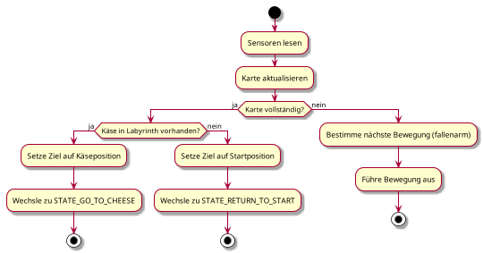
**Abbildung 4:** Aktivitätsdiagramm des Zustandes `STATE_EXPLORE`.

##### 2.2.2.3 Ablauf im Zustand `STATE_GO_TO_CHEESE`

In diesem Zustand fährt der Roboter vom aktuellen Punkt zum Zielobjekt (Käse) über den kürzesten Weg (möglichst ohne Fallen). Dabei führt er folgende Schritte aus:

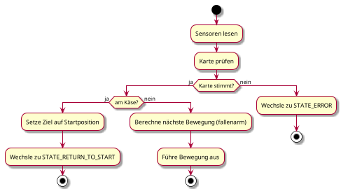
**Abbildung 5:** Aktivitätsdiagramm des Zustandes `STATE_GO_TO_CHEESE`.

##### 2.2.2.4 Ablauf im Zustand `STATE_RETURN_TO_START`

In diesem Zustand fährt der Roboter mit dem Käse vom Zielobjekt zurück zum Startpunkt über den kürzesten Weg (möglichst ohne Fallen). Dabei führt er folgende Schritte aus:

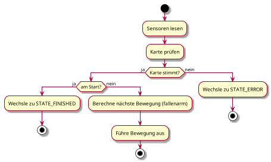
**Abbildung 6:** Aktivitätsdiagramm des Zustandes `STATE_RETURN_TO_START`.

##### 2.2.2.5 Ablauf im Zustand `STATE_FINISHED`

In diesem Zustand signalisiert der Roboter den erfolgreichen Abschluss der Aufgabe: 

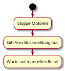
**Abbildung 7:** Aktivitätsdiagramm des Zustandes `STATE_FINISHED`.

##### 2.2.2.6 Ablauf im Zustand `STATE_ERROR`

Der Zustand `STATE_ERROR` wird erreicht, wenn ein unerwarteter oder kritischer Fehler auftritt (z. B. Sensordaten passen nicht zur erwarteten Karte). In diesem Zustand stoppt der Roboter sofort alle Bewegungen und signalisiert den Fehler eindeutig. Dabei führt er folgende Schritte aus:

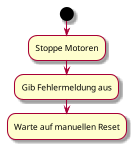
**Abbildung 8:** Aktivitätsdiagramm des Zustandes `STATE_ERROR`.


---

#### 2.3 Modul: MazeMap

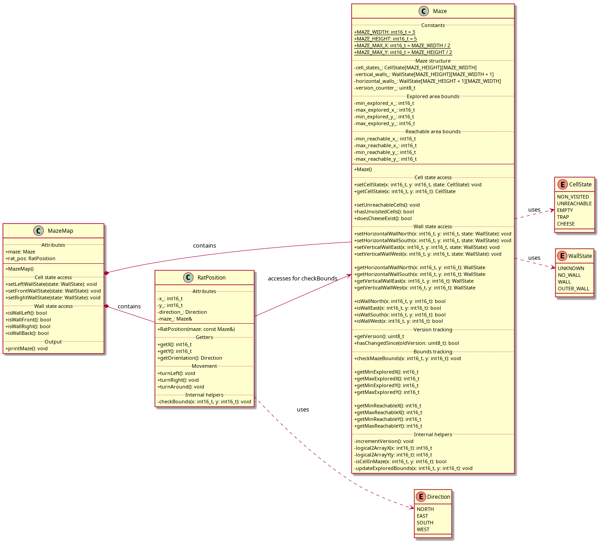
**Abbildung 9:** Klassendiagramm der Klassen im Zusammenhang mit `MazeMap`.

Die `MazeMap`-Klasse repräsentiert den gesamten internen Zustand des Labyrinths sowie die aktuelle Position des Roboters innerhalb des Labyrinths.

Sie besteht aus folgenden Komponenten:

- **Maze (Klasse)**:
  Das Labyrinth wird durch mehrere zweidimensionale Arrays dargestellt:
  - `cell_states_`: Speichert für jede Zelle mit den logischen Koordinaten (x, y) den aktuellen Zustand – unbesucht, leer, Falle, Käse oder als unerreichbar markiert.
  - `vertical_walls_`: Speichert für jede Zelle (x, y), ob sich an ihrer **westlichen** Seite eine Wand befindet, keine Wand existiert oder der Zustand unbekannt ist.
  - `horizontal_walls_`: Speichert, ob sich an der **südlichen** Seite einer Zelle (x, y) eine Wand befindet, keine Wand existiert oder der Zustand unbekannt ist.
  
  **Hinweis**: Wände, die sich am Rand des in den Arrays abbildbaren Bereichs befinden, werden als `OUTER_WALL` markiert. Diese müssen nicht erkundet werden und besitzen dauerhaft diesen Zustand. Sie verhindern, dass die Ratte aus dem gültigen Speicherbereich des Labyrinths herausfährt.
  
  Da das logische Koordinatensystem im Zentrum des Gitters verankert ist, stellt die Klasse passende Getter- und Setter-Methoden bereit, um die interne Adressierung korrekt auf die Array-Indizes abzubilden.
  Änderungen an der Karte werden durch einen Versionierungszähler (`version_counter_`) verfolgt.

- **RatPosition (Klasse)**:
  Verwaltet die aktuelle logische Position (x, y) sowie die Orientierung (NORTH, EAST, SOUTH, WEST) des Roboters im Labyrinth.


Die MazeMap-Struktur bietet somit eine zentrale Übersicht über die dynamische Welt des Roboters und dient als Basis für die Entscheidungen der NavigationEngine und die Visualisierung im Webinterface.


**Abbildung 10:** Beispielhafte Ausgabe von `MazeMap`. In der ASCII-Darstellung repräsentieren `|` und `-` erkannte Wände, während `\` und `~` die festen Außenwände (`OUTER_WALL`) des speicherbaren Labyrinthbereichs markieren. `?` steht für unbekannte Wandzustände. Die Zellen selbst zeigen `C` für Käse, `T` für Fallen, `N` für unbesuchte und `X` für unerreichbare Bereiche.

---
### 2.4 Modul: sensor_manager

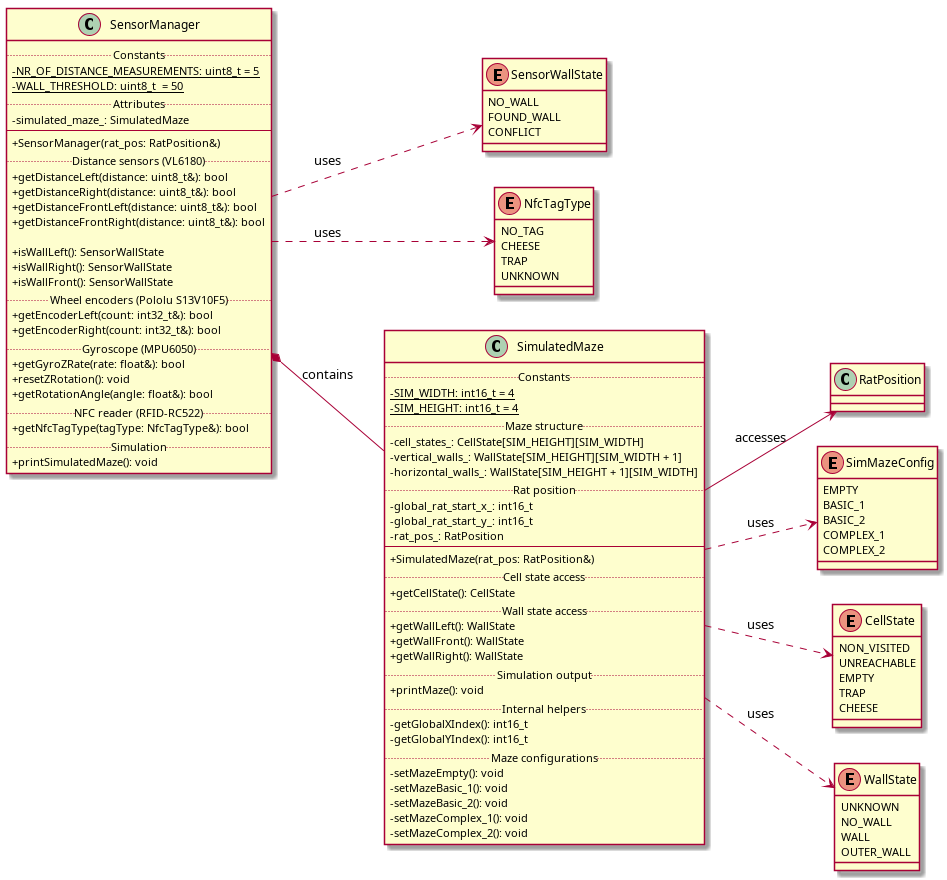
**Abbildung 11:** Klassendiagramm der Klasse `SensorManager` und `SimulatedMaze`.

#### 2.4.1 Zweck

Das Modul `sensor_manager` verwaltet alle Sensoren des Roboters. Es liest die Rohdaten aus, verarbeitet sie (Filterung, Umrechnung), und stellt sie dem Modul `movement_controller` über eine definierte Schnittstelle zur Verfügung. Alternativ können anstelle echter Sensordaten auch simulierte Werte aus dem Modul  `simulated_maze` verwendet werden, das verschiedene Labyrinthe abbildet und abhängig von der Position des Roboters passende Daten liefert.

#### 2.4.2 Sensoren

| Sensor          | Position           | Zweck                                      | Empfohlene Library             |
|-----------------|--------------------|--------------------------------------------|-------------------------------|
| VL6180X         | links              | Wandabstand zur linken Seite               | Adafruit VL6180X              |
| VL6180X         | rechts             | Wandabstand zur rechten Seite              | Adafruit VL6180X              |
| VL6180X         | vorne links        | Wandabstand vor dem linken Vorderrad       | Adafruit VL6180X              |
| VL6180X         | vorne rechts       | Wandabstand vor dem rechten Vorderrad      | Adafruit VL6180X              |
| MPU-6050        | zentral            | Drehratenerfassung zur Driftkompensation   | MPU6050 by jrowberg (I²Cdev) |
| Encoder (Pololu S13V10F5) | linker Motor       | Weg- und Drehzahlerfassung                 | Keine (GPIO/Interrupt direkt) |
| Encoder (Pololu S13V10F5) | rechter Motor      | Weg- und Drehzahlerfassung                 | Keine (GPIO/Interrupt direkt) |
| RFID-RC522      | vorne unten        | Erkennung von Ziel/Falle über NFC-Tags     | MFRC522 by miguelbalboa       |

---

#### 2.5 Modul: movement_controller
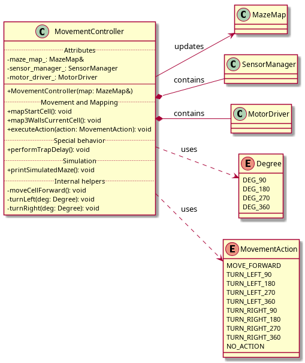
**Abbildung 12:** Klassendiagramm der Klassen `MovementController`.

#### 2.5.1 Zweck
Das Modul `MovementController` kombiniert die Bewegung des Roboters und die gleichzeitige Kartierung der Umgebung.
Es steuert die Motoren, fragt Sensordaten ab und aktualisiert die MazeMap, um neu entdeckte Wände, Fallen oder das Zielobjekt korrekt zu erfassen.
Zusätzlich reagiert es auf spezielle Ereignisse wie das Überfahren einer Falle.

### 2.6 Modul: motor_driver

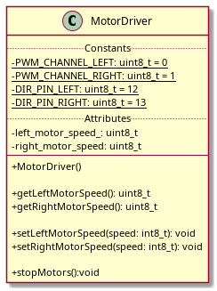
**Abbildung 13:** Klassendiagramm der Klassen `MotorDriver`.

#### 2.6.1 Zweck

Das Modul `MotorDriver` ist ein Low-Level-Hardwaretreiber zur direkten Ansteuerung der beiden Antriebsmotoren. Es steuert die PWM-Signale für Geschwindigkeit und die Richtungspins für Vorwärts- oder Rückwärtsfahrt. Das Modul wird vom `MovementController` verwendet, um grundlegende Bewegungen auszuführen.

---

#### 2.7 Modul: NavigaitonEngine

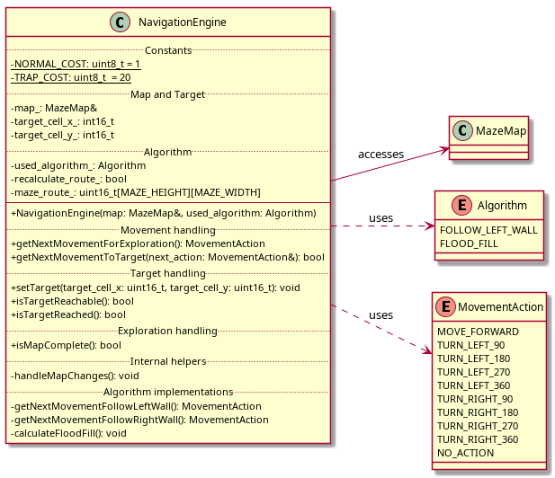
**Abbildung 14:** Klassendiagramm der Klassen `NavigationEngine`.

#### 2.7.1 Zweck
Das Modul `NavigationEngine` ist für die Bewegungsplanung des Roboters verantwortlich. Es berechnet auf Basis der aktuellen `MazeMap` den nächsten logischen Navigationsschritt – entweder zur vollständigen Exploration des Labyrinths oder zur gezielten Ansteuerung eines Ziels (z. B. Käse oder Startpunkt). Dabei werden bekannte Fallen möglichst vermieden und die effizienteste Route ermittelt. Die Ausgabe erfolgt als Bewegungsaktion (`MovementAction`), die der Roboter ausführen soll.

---

### 2.8 Modul: communication_interface

#### 2.8.1 Zweck

Das Modul `communication_interface` stellt die WLAN-Kommunikation zwischen dem Roboter und dem Webserver auf dem Raspberry Pi her. Es ermöglicht die Übertragung von Kartendaten, Statusinformationen und Sensordaten an die Weboberfläche sowie den Empfang manueller Steuerbefehle (optional). Dadurch wird der aktuelle Fortschritt im Labyrinth in Echtzeit visualisiert und eine bidirektionale Kommunikation ermöglicht.

#### 2.8.2 Funktionen

##### 2.8.2.1 `void communication_interface_init();`
Initialisiert die WLAN-Verbindung, richtet das Kommunikationsprotokoll ein und verbindet sich mit dem Webserver.

##### 2.8.2.2 `void communication_send_map_data(const MazeMap& map);`
Sendet die aktuelle Karte inklusive Roboterposition, bekannten Wänden, Fallen und Zielposition an den Webserver zur Visualisierung.

##### 2.8.2.3 `void communication_send_pose(const RobotPose& pose);`
Sendet die aktuelle Roboterposition (Zelle + Richtung) an die Weboberfläche.
